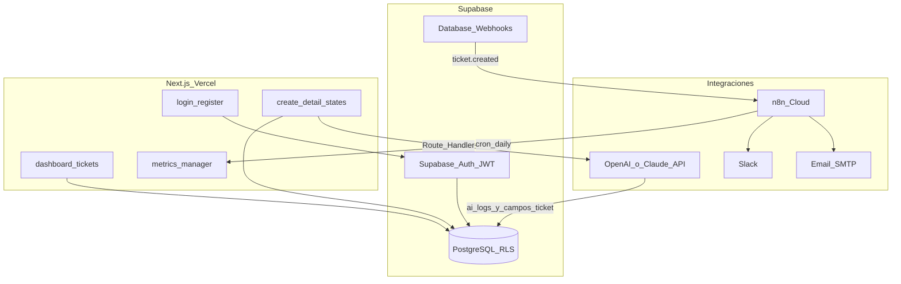
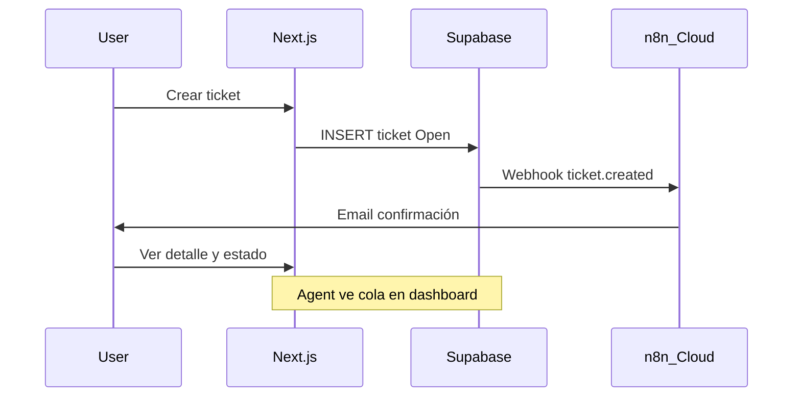

# Plan de implementación — AI Support Ticket System

## Estado actual

| Área | Estado |
|------|--------|
| Fase 1 (descubrimiento) | **Completada** — requisitos en PDFs |
| Fase 2 (fundaciones) | **~35%** — esquema DB en Supabase (hecho) + cliente/`authService` parcial en repo |
| Fases 3–5 | **0%** |

**Código existente a reutilizar:**

- Cliente Supabase: [`src/lib/supabase.ts`](src/lib/supabase.ts)
- Perfil + logout: [`src/services/authService.ts`](src/services/authService.ts) — alineado con `public.users` y enum `user_role`
- Stack: Next.js 16 + React 19 + Tailwind 4 + `@supabase/supabase-js` ([`package.json`](package.json))

**Base de datos ya creada en Supabase (SQL Editor):** enums, 6 tablas, trigger `on_auth_user_created`, 3 categorías seed. Ver sección [Esquema existente en Supabase](#esquema-existente-en-supabase).

**Brecha principal:** RLS aún por definir en Supabase, SQL no versionado en repo, sin `@supabase/ssr`, sin rutas de app, sin API/Route Handlers, sin tickets en UI, IA ni n8n.

---

## Arquitectura objetivo



**Principios (guía Venesoft):** organizar por dominio (`tickets`, `auth`, `ai`, `admin`), reglas de negocio en backend (RLS + Route Handlers), salida IA siempre JSON validado, human-in-the-loop en acciones críticas, observabilidad desde Fase 2.

---

## Estructura de carpetas propuesta

```
app/
  (auth)/login/page.tsx
  (auth)/register/page.tsx
  (dashboard)/layout.tsx          # shell + nav por rol
  (dashboard)/tickets/page.tsx
  (dashboard)/tickets/new/page.tsx
  (dashboard)/tickets/[id]/page.tsx
  (dashboard)/analytics/page.tsx  # Manager/Admin
  api/
    tickets/route.ts
    tickets/[id]/route.ts
    tickets/[id]/comments/route.ts
    ai/analyze/route.ts             # Fase 4
    webhooks/n8n/route.ts           # opcional verificación
src/
  lib/supabase/
    client.ts                       # browser
    server.ts                       # cookies SSR
    middleware.ts
  services/
    authService.ts                  # extender signIn/signUp
    ticketService.ts
    commentService.ts
    aiService.ts
    notificationService.ts
  types/
    database.ts                     # generado o manual
    ai.ts                           # AiAnalysisResult
  components/
    tickets/ ...
    ui/ ...                         # tokens Tailwind compartidos
supabase/
  schema.sql              # snapshot del SQL ya aplicado en Supabase (referencia)
  migrations/002_rls_policies.sql   # pendiente: políticas RLS
  migrations/003_indexes_optional.sql # índices de rendimiento (opcional)
docs/
  ARCHITECTURE.md
  SETUP.md
  DEMO_SCRIPT.md
PROJECT_PHASES.md                   # documento de seguimiento
.env.example
middleware.ts
```

---

## Esquema existente en Supabase

**Ya aplicado en el SQL Editor** (no recrear tablas; el código debe usar estos nombres exactos):

| Elemento | Detalle |
|----------|---------|
| **ENUMs** | `user_role` (`Admin`, `Agent`, `User`), `ticket_status` (`Open`, `In Progress`, `Resolved`), `ticket_priority` (`Low`, `Medium`, `High`, `Urgent`) |
| **categories** | `id`, `name`, `description`, `created_at` — seed: Soporte Técnico, Facturación, Accesos y Seguridad |
| **users** | `id` → `auth.users`, `email`, `full_name`, `role`, `created_at` |
| **tickets** | `user_id` (creador), `assigned_to`, `category_id`, `status`, `priority`, + columnas IA: `ai_summary`, `ai_classification`, `ai_suggestions`, `ai_risk_level` |
| **comments** | `message` (no `body`), `is_internal` |
| **notifications** | `message`, `is_read` (no `type`/`payload`) |
| **ai_logs** | `prompt`, `model_version`, `latency_ms`, `response_json` (JSONB) |
| **Trigger** | `handle_new_user()` + `on_auth_user_created` — **completado** |

**Ventaja para Fase 4:** los campos `ai_*` en `tickets` permiten mostrar el último análisis en UI sin join; `ai_logs` cumple AC 2.3 (auditoría completa).

**Pendiente en Supabase (sigue en Fase 2):**

| Ítem | Motivo |
|------|--------|
| **RLS** en todas las tablas | Seguridad por rol; sin esto el anon key expone datos |
| **Exportar SQL al repo** | `supabase/schema.sql` como fuente de verdad para el equipo |
| **Trigger `updated_at`** en `tickets` (opcional) | El campo existe pero no se actualiza solo al hacer PATCH |
| **Índices** (opcional) | `(status, priority, created_at)` en `tickets` para cola Agent |

---

## Fase 2 — Fundaciones técnicas

**Objetivo:** Completar lo que falta sobre la base ya creada: RLS, auth en app, estructura por dominio y observabilidad mínima.

### 2.1 Base de datos — ajuste al esquema real (no recrear)

**Hecho en Supabase:** tablas, enums, FKs, trigger de usuarios, categorías iniciales.

**Tareas restantes:**

1. Escribir y aplicar políticas **RLS** (ver matriz abajo).
2. Copiar el script SQL al repo como [`supabase/schema.sql`](supabase/schema.sql) (snapshot, no re-ejecutar en prod salvo drift).
3. Añadir [`supabase/migrations/002_rls_policies.sql`](supabase/migrations/002_rls_policies.sql) solo con el delta RLS.
4. `supabase gen types typescript` → [`src/types/database.ts`](src/types/database.ts) reflejando enums y columnas reales.

**Matriz RLS propuesta:**

| Rol | tickets | comments | users | notifications | ai_logs |
|-----|---------|----------|-------|---------------|---------|
| **User** | SELECT/INSERT propios; UPDATE solo si `user_id = auth.uid()` y estado permite | SELECT no internos en sus tickets; INSERT en sus tickets | SELECT propio | SELECT/UPDATE propias | — |
| **Agent** | SELECT cola + asignados; UPDATE status/priority/assigned_to | SELECT/INSERT incl. internos en tickets de cola | SELECT propio | SELECT propias | SELECT en tickets que atiende |
| **Admin** | ALL | ALL | SELECT all; UPDATE `role` | ALL | SELECT all |

**Servicios — mapeo de columnas (evitar nombres del plan anterior):**

```typescript
// tickets: usar user_id, no created_by
// comments: usar message, no body
// notifications: usar message, is_read
// IA: escribir ai_logs + opcionalmente tickets.ai_summary | ai_classification | ai_suggestions | ai_risk_level
```

### 2.2 Autenticación

- Añadir `@supabase/ssr` + [`middleware.ts`](middleware.ts) para proteger `(dashboard)/**`.
- Extender [`authService.ts`](src/services/authService.ts): `signIn`, `signUp`, `resetPassword`.
- Páginas `login` y `register` con validación (email, password, nombre).
- Hook/contexto `useAuth` o Server Component que cargue perfil + rol.

### 2.3 Estructura frontend/backend

- Reemplazar placeholder [`app/page.tsx`](app/page.tsx) por redirect según sesión.
- Layout dashboard con navegación condicional por rol.
- Servicios por capacidad de negocio (`ticketService`, no lógica CRUD duplicada en cada página).

### 2.4 Observabilidad mínima

- Logger estructurado en Route Handlers (`console` + formato JSON en prod, o integración ligera tipo Vercel Logs).
- Tabla **`ai_logs`** ya existe — los Route Handlers de Fase 4 la usarán; en Fase 2 solo documentar el contrato.
- Manejo uniforme de errores API: `{ error, code }` + estados UI (`loading`, `error`, `empty`, `success`).

### 2.5 Configuración y repo

- [`.env.example`](.env.example): Supabase, `OPENAI_API_KEY` o `ANTHROPIC_API_KEY`, `N8N_WEBHOOK_*`, `N8N_WEBHOOK_SECRET`.
- [`README.md`](README.md) + `docs/SETUP.md` con pasos Supabase + Vercel.
- Generar tipos: `supabase gen types` → `src/types/database.ts`.

**Criterio de cierre Fase 2:** usuario puede registrarse (trigger crea fila en `users`), iniciar sesión, ver dashboard vacío según rol; **RLS activo y probado** con User/Agent/Admin; SQL exportado al repo.

---

## Fase 3 — Flujo principal end-to-end

**Objetivo:** Recorrido crítico User → ticket → visibilidad Agent/Admin, con automatización mínima (email al crear).

### User stories y criterios

| US | Entregable | AC del PDF |
|----|------------|------------|
| **US-01** Crear ticket | Formulario `tickets/new`, `POST /api/tickets` | AC 1.1 validación título/descripción/categoría; AC 1.2 estado inicial `Open` |
| **US-02** Ver estado | Lista + detalle usuario, actualización en tiempo real (Supabase Realtime o revalidación) | Transparencia de estado y comentarios públicos |
| **US-03** Asignar roles | Panel Admin en `/admin/users` | Solo Admin modifica `users.role` |

### Flujo E2E prioritario



### Implementación tickets

- **API:** `GET/POST /api/tickets`, `GET/PATCH /api/tickets/[id]`, comentarios en sub-ruta.
- **UI:** dashboard con filtros por estado; badges Open / In Progress / Resolved; transiciones permitidas por rol.
- **US-04 (parcial):** Agent ve listado ordenado por `ticket_priority` (`Urgent` > `High` > …) + `created_at` — el enum ya incluye `Urgent`, alineado con alertas de prioridad alta.

### n8n — flujo 1 (mínimo Fase 3)

- **Workflow:** `ticket-created-email`
- **Trigger:** Webhook desde Supabase Database Webhook o Route Handler post-insert → URL n8n Cloud.
- **Nodos:** validar payload → enviar email (Gmail/SMTP) → error branch + 2 reintentos (AC 3.2 parcial).
- Documentar URL y secret en `docs/N8N_WORKFLOWS.md`.

**Criterio de cierre Fase 3:** demo interna: User crea ticket → recibe email → ve estado; Agent ve ticket en cola; Admin cambia un rol; todo desplegado en preview Vercel + Supabase.

---

## Fase 4 — IA y automatizaciones de valor

**Objetivo:** Capa cognitiva + n8n Slack + conexión IA → automatización; medición básica.

### Proveedor IA

Abstracción en `aiService.ts` con adapter (recomendación: **OpenAI** `gpt-4o-mini` para JSON estructurado y costo; alternativa Claude vía mismo contrato). Una sola variable de entorno activa.

### Contrato JSON obligatorio

```typescript
// src/types/ai.ts
interface AiAnalysisResult {
  summary: string;
  classification: string;  // categoría o prioridad
  suggestions: string;
  riskLevel: 'low' | 'medium' | 'high';
  recommendedAction?: 'assign' | 'escalate' | 'close' | 'request_info';
}
```

**Route Handler** `POST /api/ai/analyze`:
1. Normalizar entrada: título, descripción, categoría, comentarios previos (`comments.message`).
2. Prompt con instrucciones de clasificación, sentimiento, resumen, sugerencia, riesgo, acción siguiente.
3. `response_format: json_object` (OpenAI) o tool/schema (Claude).
4. Validar con Zod; rechazar si falta alguna llave (AC 2.2).
5. **Persistencia dual (AC 2.3):**
   - `INSERT` en **`ai_logs`** (`prompt`, `model_version`, `latency_ms`, `response_json`).
   - `UPDATE` en **`tickets`**: `ai_summary`, `ai_classification`, `ai_suggestions`, `ai_risk_level` (y opcionalmente `priority` tras aprobación humana).
6. **Human-in-the-loop:** UI en detalle del ticket — agente revisa y aprueba antes de aplicar sugerencia como comentario o cambio de `priority`.

### User stories Fase 4

| US | Feature |
|----|---------|
| **US-04** | Tras análisis IA, sugerir/actualizar `priority` (`High`/`Urgent`); ordenar cola por `priority` + `ai_risk_level` |
| **US-05** | Panel "Sugerencia IA" lee `tickets.ai_suggestions` (o `response_json.suggestions`) — editable antes de enviar |
| **US-06** | Botón "Resumir" → `tickets.ai_summary` |
| **US-07** | n8n evalúa `ai_risk_level` o `priority IN ('High','Urgent')` → Slack inmediato |

### n8n — flujos 2 y 3

| Workflow | Trigger | Acción |
|----------|---------|--------|
| `high-priority-slack` | Webhook post-IA o DB update `priority=high` | Mensaje estructurado a Slack; error + reintentos (AC 3.1, 3.2) |
| `daily-manager-report` | Cron 08:00 | Agregar tickets por estado → email/Slack al manager |

**Automatización conectada:** tras guardar análisis IA, Route Handler opcional dispara webhook n8n con `{ ticketId, riskLevel, classification }`.

### Métricas Fase 4 (mínimas)

- Agregados sobre **`ai_logs`**: latencia promedio (`latency_ms`), tasa de error API.
- Campo opcional futuro en `ai_logs` (migración): `agent_accepted_suggestion` — no bloquea MVP.

**Criterio de cierre Fase 4:** Agent abre ticket largo → resumen + sugerencia en &lt;30s; prioridad alta dispara Slack; auditoría consultable en DB.

---

## Fase 5 — Cierre de entrega

**Objetivo:** Producto presentable, estable y desplegado.

### US-08 — Métricas Manager

- Página `/analytics`: tickets por estado, tiempo medio Open→Resolved, tickets por categoría/prioridad, volumen últimos 7/30 días.
- Queries agregadas en Supabase (vistas SQL o RPC) — solo Admin/Manager.

### Pulido transversal

| Área | Tareas |
|------|--------|
| UX | Estados vacíos, skeletons, mensajes de error claros, diseño consistente (tokens Tailwind) |
| Seguridad | Revisión RLS, rate limit en `/api/ai/analyze`, secrets solo server-side, CORS/webhook secrets |
| Rendimiento | Índices DB, paginación en listados, `loading.tsx` donde aplique |
| Deploy | Prod en Vercel + Supabase; variables por entorno; checklist pre-demo |
| Documentación | `README`, `ARCHITECTURE.md`, `DEMO_SCRIPT.md` (roles PO, FE, BE, AI/Automation) |
| Git | Issues/PRs ligados a US; hooks opcionales pre-commit lint |

**Criterio de cierre Fase 5 (DoD del proyecto):**
1. App funcional online (Vercel + Supabase).
2. Repo con setup y arquitectura documentados.
3. 8 user stories con AC verificados.
4. 3 workflows n8n activos con manejo de errores.
5. IA integrada en flujo real con auditoría.
6. Demo script ejecutable en 10–15 min.

---

## Mapa user stories → fases

| ID | Prioridad PDF | Fase | Estado repo |
|----|---------------|------|-------------|
| US-01 | Alta | 3 | Pendiente |
| US-02 | Alta | 3 | Pendiente |
| US-03 | Alta | 3 | Pendiente |
| US-04 | Media | 4 | Pendiente |
| US-05 | Media | 4 | Pendiente |
| US-06 | Media | 4 | Pendiente |
| US-07 | Media | 4 | Pendiente |
| US-08 | Baja | 5 | Pendiente |

---

## Documento de seguimiento: `PROJECT_PHASES.md`

Se creará en la raíz del repo al aprobar el plan. Estructura:

1. **Resumen ejecutivo** — fase actual, % estimado, última actualización, bloqueadores.
2. **Tablero por fase** — checklist con casillas `[ ]` / `[x]` por ítem técnico.
3. **Tablero por user story** — US-01…US-08 con AC enlazados y estado (`No iniciado` \| `En progreso` \| `Hecho` \| `Bloqueado`).
4. **Entregables externos** — Supabase project URL, Vercel URL, n8n workflow IDs.
5. **Registro de sesiones** — tabla fecha \| qué se hizo \| siguiente paso (para retomar tras pausa).
6. **Riesgos y decisiones** — ADR cortos (ej. proveedor IA elegido, webhooks vs polling).

**Estado inicial sugerido al crear el archivo:**

- Fase 1: Completada (100%)
- Fase 2: En progreso (~35%) — DB en Supabase hecha; falta RLS + app auth
- Fases 3–5: No iniciadas

---

## Orden de implementación recomendado (sprints lógicos)

1. ~~Migraciones + seed categorías~~ **Hecho en Supabase** → exportar `schema.sql` + aplicar **RLS** + `gen types`  
2. SSR auth + login/register + middleware  
3. Ticket CRUD API + páginas lista/crear/detalle  
4. Admin roles + estados del ticket  
5. Webhook n8n email (US-01 AC 1.3)  
6. Deploy preview y validación interna  
7. `aiService` + analyze endpoint + UI agente  
8. n8n Slack + reporte diario  
9. Analytics + pulido + demo  

**Estimación orientativa:** Fase 2 (1–2 semanas), Fase 3 (1–2 semanas), Fase 4 (1–2 semanas), Fase 5 (3–5 días) — según dedicación del equipo.

---

## Dependencias a instalar (próximos pasos técnicos)

- `@supabase/ssr`
- `zod` (validación API + respuesta IA)
- Opcional: `openai` SDK o `@anthropic-ai/sdk`

Variables n8n Cloud: crear 3 workflows y copiar webhook URLs a Vercel/Supabase.
