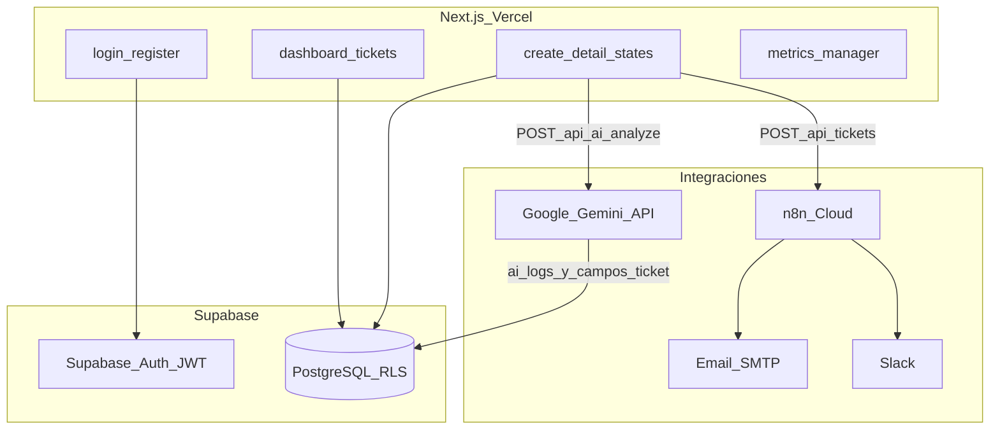

# Plan de implementación — AI Support Ticket System

## Auditoría de progreso (actualización equipo)

Evaluación según **código en repo**, **user stories del PDF** y **validación operativa reportada**.  
Sincronizar con [`PROJECT_PHASES.md`](../../PROJECT_PHASES.md).

| Fase | Objetivo | Progreso | Estado |
|------|----------|----------|--------|
| **1** Descubrimiento | Requisitos, US, DoD | **100%** | Completada |
| **2** Fundaciones | DB, auth, RLS, estructura | **100%** | Completada — RLS ejecutado en Supabase |
| **3** Flujo E2E | Tickets + email n8n | **100%** | Completada — workflows n8n funcionando |
| **4** IA + n8n | Gemini + Slack + reporte | **~95%** | Gemini + email/Slack OK; **reporte diario sin probar** |
| **5** Cierre | UX, docs, deploy | **~80%** | Docs/build OK — **deploy Vercel pendiente** |

**Progreso global estimado: ~94%**

### Validación reciente (equipo)

| # | Ítem | Estado |
|---|------|--------|
| 1 | Workflows n8n (email + Slack) | **OK** — funcionan correctamente |
| 2 | RLS en Supabase (`002_rls_policies.sql`) | **OK** — ejecutado |
| 3 | Deploy Vercel producción | **Pendiente** |
| 4 | Workflow reporte diario (cron n8n) | **Creado** — **sin prueba aún** |

---

## Decisión técnica: IA con Google Gemini

| Aspecto | Definición del proyecto |
|---------|-------------------------|
| **Proveedor único** | [Google Gemini API](https://ai.google.dev/) — chat/análisis de tickets |
| **Variable de entorno** | `GEMINI_API_KEY` |
| **Selector** | `AI_PROVIDER=gemini` (valor por defecto recomendado en `.env.local`) |
| **Modelo en código** | `gemini-2.0-flash` o el definido en [`src/services/aiService.ts`](../../src/services/aiService.ts) (`GEMINI_MODEL`) |
| **Salida** | JSON estricto vía `responseMimeType: application/json` |
| **Auditoría** | Tabla `ai_logs` + campos `tickets.ai_*` (AC 2.3) |

**No forman parte del alcance acordado:** OpenAI ni Anthropic como proveedor principal. El código actual aún incluye rutas legacy OpenAI/Anthropic; el plan asume **migración documental y operativa a solo Gemini** (limpieza opcional de dependencias `openai` en backlog).

```env
# .env.local — IA (obligatorio para Fase 4)
AI_PROVIDER=gemini
GEMINI_API_KEY=tu-api-key-de-google-ai-studio
```

---

## Estado actual del repositorio

**Implementado en código:**

- Supabase SSR: [`src/lib/supabase/`](../../src/lib/supabase/), [`middleware.ts`](../../middleware.ts)
- Auth: login, register, [`/auth/setup`](../../app/auth/setup/page.tsx), [`POST /api/auth/register`](../../app/api/auth/register/route.ts)
- Tickets: API + UI (`/tickets`, crear, detalle, estados, comentarios)
- Admin: [`/admin/users`](../../app/(dashboard)/admin/users/page.tsx) + prueba n8n
- IA: [`POST /api/ai/analyze`](../../app/api/ai/analyze/route.ts) + [`src/services/aiService.ts`](../../src/services/aiService.ts) (Gemini)
- Analytics: [`/analytics`](../../app/(dashboard)/analytics/page.tsx)
- SQL: [`supabase/schema.sql`](../../supabase/schema.sql), [`002_rls_policies.sql`](../../supabase/migrations/002_rls_policies.sql), [`003_fix_signup_trigger.sql`](../../supabase/migrations/003_fix_signup_trigger.sql)

**Pendientes para cierre del proyecto:**

| Ítem | Prioridad | Acción |
|------|-----------|--------|
| **Deploy Vercel** | Alta | Importar repo, configurar env (Supabase, Gemini, n8n), deploy prod |
| **Probar reporte diario n8n** | Media | Ejecutar manualmente el cron o esperar horario → verificar email/Slack al manager |
| Demo en producción | Alta | Tras deploy, seguir `docs/DEMO_SCRIPT.md` |

---

## Arquitectura objetivo



---

## Mapa user stories → progreso real

| ID | Fase | Estado | Notas |
|----|------|--------|-------|
| **US-01** Crear ticket | 3 | **Hecho** | Validación OK + email n8n confirmado |
| **US-02** Ver estado | 3 | **Hecho** | Lista + detalle; polling ~15s (no Realtime Supabase) |
| **US-03** Roles Admin | 3 | **Hecho** | `/admin/users` |
| **US-04** Cola priorizada | 4 | **Hecho** | Orden por `priority` + IA puede aplicar prioridad |
| **US-05** Sugerencia IA | 4 | **Hecho** | Panel editable + Gemini |
| **US-06** Resumen IA | 4 | **Hecho** | `ai_summary` en detalle |
| **US-07** Alertas alta prioridad | 4 | **Hecho** | Webhook + Slack vía n8n operativo |
| **US-08** Métricas manager | 5 | **Hecho** (MVP) | `/analytics` agregados básicos |

---

## Fase 1 — Descubrimiento (100%)

- [x] Objetivo y usuarios definidos (PDF requisitos)
- [x] User stories US-01…US-08 priorizadas
- [x] Criterios de aceptación y DoD acordados

---

## Fase 2 — Fundaciones técnicas (100%)

**Objetivo:** Base de datos, autenticación, estructura, observabilidad mínima.

### Checklist

| Ítem | Repo | Supabase prod |
|------|------|---------------|
| Esquema 6 tablas + enums | [x] | [x] |
| Trigger `handle_new_user` | [x] | [x] |
| RLS por rol | [x] script `002` | [x] **Ejecutado** |
| `@supabase/ssr` + middleware | [x] | — |
| Login / Register / setup perfil | [x] | — |
| `SUPABASE_SERVICE_ROLE_KEY` registro | [x] | — |
| `.env.example` (solo Gemini) | [x] | — |
| Logger + errores API uniformes | [x] | — |

**Criterio de cierre:** cumplido.

---

## Fase 3 — Flujo principal E2E (100%)

**Objetivo:** User crea ticket → Agent/Admin ven cola → email confirmación.

### Checklist

| Ítem | Estado |
|------|--------|
| `GET/POST /api/tickets` | [x] |
| `GET/PATCH /api/tickets/[id]` + comentarios | [x] |
| UI lista / crear / detalle / estados | [x] |
| Webhook `N8N_WEBHOOK_TICKET_CREATED` | [x] |
| Email real al usuario (n8n) | [x] **Validado** |

**Criterio de cierre:** cumplido.

---

## Fase 4 — IA (Gemini) y automatizaciones (~95%)

**Objetivo:** Análisis con Gemini; n8n Slack; medición en `ai_logs`.

### IA — solo Gemini

| Paso | Estado |
|------|--------|
| `aiService.ts` → Gemini + JSON | [x] |
| Validación Zod | [x] |
| `POST /api/ai/analyze` + `ai_logs` + `tickets.ai_*` | [x] |
| Human-in-the-loop | [x] |
| `GEMINI_API_KEY` en `.env.example` | [x] |

### Contrato JSON (sin cambios)

```typescript
interface AiAnalysisResult {
  summary: string;
  classification: string;
  suggestions: string;
  riskLevel: 'low' | 'medium' | 'high';
  recommendedAction?: 'assign' | 'escalate' | 'close' | 'request_info';
}
```

### n8n

| Workflow | Código | n8n Cloud | Prueba |
|----------|--------|-----------|--------|
| Email al crear ticket | [x] | [x] Active | [x] OK |
| Slack prioridad alta | [x] | [x] Active | [x] OK |
| Reporte diario manager | — (cron) | [x] Creado | [ ] **Sin probar** |

**Criterio de cierre:** cumplido salvo validación explícita del reporte diario.

**Cómo probar el reporte diario:** en n8n → workflow → *Execute workflow* (manual) o esperar el cron → confirmar que el manager recibe el resumen por email/Slack configurado.

---

## Fase 5 — Cierre de entrega (~80%)

**Objetivo:** Producto presentable y desplegado en producción.

### Checklist

| Ítem | Estado |
|------|--------|
| `/analytics` (US-08) | [x] MVP |
| Documentación (`README`, `docs/*`) | [x] |
| `npm run build` exitoso | [x] |
| Deploy **producción** Vercel + variables env | [ ] **Pendiente** |
| Demo 10–15 min en URL pública | [ ] tras deploy |
| Pulido UX opcional | [ ] nice-to-have |

**DoD proyecto (7 puntos PDF):**

1. [ ] App online Vercel + Supabase  
2. [x] Repo con setup y arquitectura  
3. [x] 8 US funcionales (reporte diario: workflow listo, falta prueba formal)  
4. [~] 3 workflows n8n — 2 probados + 1 sin probar  
5. [x] IA Gemini + auditoría `ai_logs`  
6. [ ] Demo script validado en prod  
7. [x] Seguimiento `PROJECT_PHASES.md`  

---

## Esquema Supabase (referencia)

Ya aplicado en SQL Editor — no recrear. Detalle en [`supabase/schema.sql`](../../supabase/schema.sql).

Campos IA en `tickets`: `ai_summary`, `ai_classification`, `ai_suggestions`, `ai_risk_level`.  
Auditoría: tabla `ai_logs`.

---

## Estructura de carpetas (estado actual)

```
app/
  (auth)/login, register
  (dashboard)/dashboard, tickets/, admin/users, analytics
  auth/setup
  api/ tickets, categories, ai/analyze, admin/, auth/, analytics
src/
  lib/supabase/, auth.ts, n8n.ts, logger.ts, ...
  services/ authService.ts, aiService.ts  ← Gemini
  components/ tickets, auth, admin, ui, analytics
  types/ database.ts, ai.ts
supabase/ schema.sql, migrations/
docs/ SETUP, N8N_WORKFLOWS, ARCHITECTURE, DEMO_SCRIPT, API_FLOW
middleware.ts
PROJECT_PHASES.md
```

---

## Próximos pasos (orden recomendado)

1. **Probar reporte diario:** ejecutar manualmente el workflow cron en n8n y confirmar entrega al manager.  
2. **Deploy Vercel:** importar repo → Variables: `NEXT_PUBLIC_SUPABASE_*`, `SUPABASE_SERVICE_ROLE_KEY`, `GEMINI_API_KEY`, `AI_PROVIDER=gemini`, `N8N_WEBHOOK_*` → Deploy.  
3. **Smoke test en prod:** registro, ticket, email, IA, Slack, `/analytics`.  
4. **Demo final:** `docs/DEMO_SCRIPT.md` con URL pública.  
5. **Backlog opcional:** limpiar dependencia `openai` del código; pulido UX.

---

## Dependencias del proyecto

| Paquete | Uso |
|---------|-----|
| `@supabase/ssr`, `@supabase/supabase-js` | Auth + DB |
| `@google/generative-ai` | Disponible en package.json (Gemini vía fetch en aiService) |
| `zod` | Validación API + respuesta IA |
| `openai` | Legacy — **no usar** según este plan; eliminar en refactor opcional |

Variables críticas: `GEMINI_API_KEY`, `N8N_WEBHOOK_TICKET_CREATED`, `N8N_WEBHOOK_HIGH_PRIORITY`, `SUPABASE_SERVICE_ROLE_KEY`.
