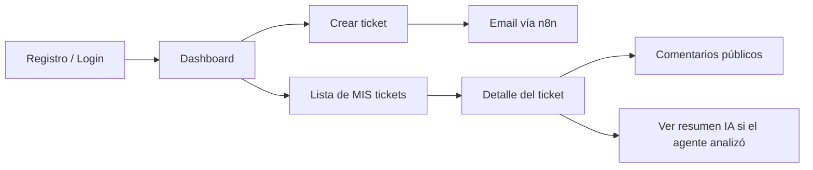
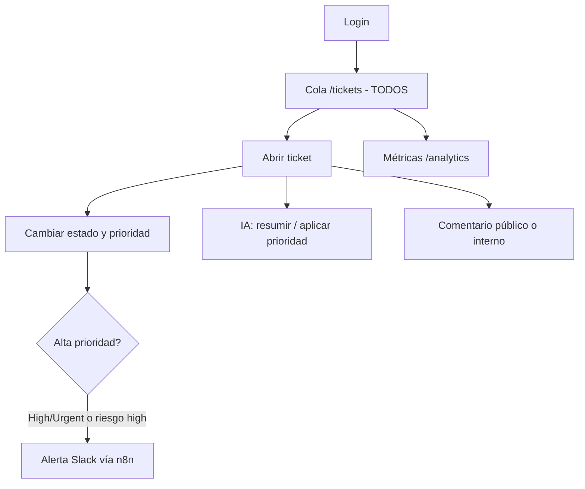

# Roles, permisos y flujos del sistema

Guía de referencia para entender **qué hace cada rol**, **qué pantallas y acciones tiene disponibles** y **cuándo usar cada función** en el sistema de tickets Mora.

---

## 1. Resumen ejecutivo

El sistema define **tres roles** en la base de datos (`user_role`):

| Rol | Propósito principal |
|-----|---------------------|
| **User** | Cliente o solicitante: reporta incidentes y sigue **solo sus** tickets. |
| **Agent** | Soporte operativo: atiende **toda la cola**, cambia estado/prioridad, usa IA y ve métricas. |
| **Admin** | Gestión del sistema: todo lo del Agent **más** administración de usuarios, pruebas n8n y vista previa del reporte diario. |

La jerarquía de capacidades es:

```
User  ⊂  Agent  ⊂  Admin
```

Un **Admin** hereda automáticamente los permisos de **Agent** (funciones `canAccessAgent` y `canAccessAnalytics` incluyen a Admin).

---

## 2. Cómo se asigna cada rol

### Registro nuevo

1. El usuario se registra en `/register` (API `POST /api/auth/register`).
2. Supabase crea la cuenta en `auth.users`.
3. Un trigger (`handle_new_user`) inserta el perfil en `public.users` con rol **`User`** por defecto.
4. Tras el primer inicio de sesión, si falta perfil, se redirige a `/auth/setup` para completarlo.

### Cambio de rol (solo Admin)

1. Un usuario con rol **Admin** entra a **`/admin/users`**.
2. En la tabla de usuarios elige **User**, **Agent** o **Admin** y pulsa **Guardar**.
3. La API `PATCH /api/admin/users` actualiza el campo `role` en `public.users`.

**Importante:** No hay auto-registro como Agent o Admin. El primer Admin debe crearse manualmente en Supabase (o promover un usuario desde la consola) antes de poder gestionar roles desde la app.

---

## 3. Navegación por rol

El menú superior (`DashboardNav`) filtra enlaces según el rol:

| Enlace | User | Agent | Admin |
|--------|:----:|:-----:|:-----:|
| Inicio (`/dashboard`) | ✓ | ✓ | ✓ |
| Tickets (`/tickets`) | ✓ | ✓ | ✓ |
| Nuevo ticket (`/tickets/new`) | ✓ | ✓ | ✓ |
| Métricas (`/analytics`) | — | ✓ | ✓ |
| Perfil (`/settings`) | ✓ | ✓ | ✓ |
| Usuarios (`/admin/users`) | — | — | ✓ |

En el encabezado se muestra el nombre y el rol activo (por ejemplo: `María · Agent`).

---

## 4. Matriz de permisos detallada

### 4.1 Tickets

| Acción | User | Agent | Admin | Notas |
|--------|:----:|:-----:|:-----:|-------|
| Crear ticket | ✓ | ✓ | ✓ | Siempre como solicitante (`user_id` = quien crea). |
| Ver listado | Solo los propios | Todos | Todos | API filtra por `user_id` si el rol es User. |
| Abrir detalle | Solo los propios | Todos | Todos | RLS en Supabase refuerza el mismo criterio. |
| Cambiar **estado** | — (UI) | ✓ | ✓ | Open → In Progress → Resolved. |
| Cambiar **prioridad** | — (UI) | ✓ | ✓ | Low, Medium, High, Urgent. |
| Asignar `assigned_to` | — | ✓* | ✓* | Campo en BD/API; la UI actual no expone selector de asignación. |

\* Disponible vía API `PATCH /api/tickets/[id]`; la interfaz actual solo muestra estado y prioridad.

### 4.2 Comentarios

| Acción | User | Agent | Admin |
|--------|:----:|:-----:|:-----:|
| Comentario **público** | ✓ | ✓ | ✓ |
| Comentario **interno** (`is_internal`) | — | ✓ | ✓ |
| Ver notas internas | — | ✓ | ✓ |

Los comentarios internos aparecen con fondo ámbar y la etiqueta **「Nota interna」**. El solicitante **nunca** los ve en lista ni en detalle.

### 4.3 Inteligencia artificial

| Acción | User | Agent | Admin |
|--------|:----:|:-----:|:-----:|
| Panel **Asistente IA** completo | — | ✓ | ✓ |
| Resumir y sugerir | — | ✓ | ✓ |
| Analizar y aplicar prioridad | — | ✓ | ✓ |
| Aprobar sugerencia como comentario | — | ✓ | ✓ |
| Ver solo resumen IA (si existe) | ✓ | ✓ | ✓ |

### 4.4 Administración y reportes

| Acción | User | Agent | Admin |
|--------|:----:|:-----:|:-----:|
| Métricas (`/analytics`) | — | ✓ | ✓ |
| Gestionar roles de usuarios | — | — | ✓ |
| Probar webhooks n8n | — | — | ✓ |
| Vista previa reporte diario | — | — | ✓ |
| `GET /api/reports/daily` (cron n8n) | — | — | Secret compartido* |

\* No es un rol de usuario: n8n llama con header `X-Cron-Secret` / `X-Webhook-Secret`.

### 4.5 Perfil personal

| Acción | User | Agent | Admin |
|--------|:----:|:-----:|:-----:|
| Editar nombre (`/settings`) | ✓ | ✓ | ✓ |
| Cambiar contraseña (Supabase Auth) | ✓ | ✓ | ✓ |

---

## 5. Flujo por rol (paso a paso)

### 5.1 Rol **User** (solicitante)

**Objetivo:** Reportar problemas y seguir el avance de sus solicitudes.



#### Flujo típico

1. **Inicio** → `/dashboard`: ve contador de **sus** tickets y acceso rápido a crear uno nuevo.
2. **Nuevo ticket** → `/tickets/new`:
   - Título, descripción, categoría.
   - Al guardar: estado `Open`, prioridad `Medium`.
   - Se dispara webhook **ticket.created** (email de confirmación vía n8n, si está configurado).
   - Se registra una notificación en BD para el usuario.
3. **Tickets** → `/tickets`: lista **solo sus** tickets, ordenados por prioridad.
4. **Detalle** → `/tickets/[id]`:
   - Lee título, descripción, estado y prioridad (no puede cambiarlos desde la UI).
   - Añade **comentarios públicos** para aportar información al soporte.
   - Si un agente ejecutó IA, puede ver un bloque reducido **「Estado del análisis」** con el resumen (`ai_summary`), no el panel completo de IA.

#### Qué NO debe esperar un User

- No ve tickets de otros usuarios.
- No ve notas internas del equipo.
- No accede a Métricas ni Administración.
- No ejecuta análisis con IA.

#### Restricción en base de datos (RLS)

Un User **podría** actualizar su propio ticket vía API solo mientras el estado sea **`Open`** (`tickets_update_own`). La interfaz actual **no** expone esos controles al User; el cambio de estado lo hace el Agent/Admin.

---

### 5.2 Rol **Agent** (soporte)

**Objetivo:** Resolver la cola de tickets, comunicarse con solicitantes y usar IA para acelerar respuestas.



#### Flujo típico de atención

1. **Cola** → `/tickets`: ve **todos** los tickets del sistema (orden por prioridad).
2. **Abrir ticket** → `/tickets/[id]`:
   - Ve quién **creó** el ticket (nombre o email).
   - **Estado:** usar cuando avanza el trabajo:
     - `Open` — recién creado o sin atender.
     - `In Progress` — alguien está trabajando en ello.
     - `Resolved` — cerrado / solucionado.
   - **Prioridad:** ajustar según impacto real (no solo la sugerencia de IA).
3. **Comentarios:**
   - **Público:** el User lo ve; usar para respuestas al cliente.
   - **Interno:** solo Agent/Admin; usar para coordinación interna («escalé a infra», «esperando proveedor»).
4. **Asistente IA** (panel lateral):
   - **「Resumir y sugerir」:** analiza título, descripción, categoría y comentarios; guarda resumen, clasificación, sugerencias, sentimiento y riesgo en el ticket; **no** cambia la prioridad.
   - **「Analizar y aplicar prioridad」:** igual que arriba y además mapea riesgo → prioridad:
     - `high` → `Urgent`
     - `medium` → `High`
     - `low` → `Medium`
   - **「Aprobar y publicar como comentario」:** envía el texto editable de la sugerencia como comentario **público** (el User lo verá).
5. **Métricas** → `/analytics`: totales, distribución por estado/prioridad, tasa de resolución, tickets últimos 7 días.

#### Cuándo usar cada acción de IA

| Botón | Cuándo usarlo |
|-------|----------------|
| Resumir y sugerir | Primera lectura del ticket; necesitas contexto y borrador de respuesta sin comprometer la prioridad manual. |
| Analizar y aplicar prioridad | Quieres que el sistema ajuste la cola automáticamente según el análisis de riesgo (revisar después el resultado). |
| Aprobar y publicar… | Ya editaste la sugerencia de IA y quieres enviarla al cliente como comentario oficial. |

#### Alertas automáticas (Agent dispara indirectamente)

Al poner prioridad **High** o **Urgent**, o si la IA marca **riesgo high**, o al aplicar prioridad desde IA con riesgo alto:

- Webhook **high_priority** → Slack (n8n).
- Notificaciones en BD al **dueño del ticket** y a **todos los Agent y Admin**.

---

### 5.3 Rol **Admin** (administrador)

**Objetivo:** Configurar personas, validar integraciones y supervisar reportes; además puede operar tickets como un Agent.

```mermaid
flowchart TB
  subgraph operacion [Operación - igual que Agent]
    T[Cola y tickets]
    M[Métricas]
    AI[IA en tickets]
  end
  subgraph admin [Solo Admin]
    U[/admin/users - roles]
    N[Probar n8n]
    R[Vista previa reporte diario]
  end
  A[Login Admin] --> operacion
  A --> admin
```

#### Flujo de administración

1. **Usuarios** (`/admin/users`):
   - Listar email, nombre y rol.
   - Promover a **Agent** cuando alguien debe atender tickets.
   - Promover a **Admin** solo para responsables de sistema (mínimo necesario).
   - Degradar a **User** cuando deja de ser soporte.
2. **Probar conexión n8n:**
   - Envía POST de prueba a webhooks configurados en variables de entorno.
   - Verifica en n8n → Executions que llegaron los eventos.
3. **Vista previa reporte diario:**
   - Muestra el JSON que consumirá el cron de n8n (`GET /api/reports/daily` con secret).
   - Sirve para validar totales antes de activar el workflow programado.

#### Qué hace el Admin que el Agent no hace

| Función | Descripción |
|---------|-------------|
| Cambiar roles | Control de quién es User / Agent / Admin. |
| n8n test | Diagnóstico de `N8N_WEBHOOK_TICKET_CREATED` y `N8N_WEBHOOK_HIGH_PRIORITY`. |
| Reporte diario preview | Inspección del payload del cron sin esperar al horario. |

El Admin **no** tiene pantallas extra de tickets respecto al Agent; la diferencia es administrativa.

---

## 6. Ciclo de vida de un ticket

### Estados (`ticket_status`)

| Estado | Significado | Quién lo cambia (en la práctica) |
|--------|-------------|----------------------------------|
| **Open** | Pendiente de atención. | User al crear; Agent al reabrir manualmente si aplica. |
| **In Progress** | En trabajo activo. | Agent / Admin. |
| **Resolved** | Cerrado o resuelto. | Agent / Admin. |

### Prioridades (`ticket_priority`)

| Prioridad | Uso recomendado |
|-----------|-----------------|
| **Low** | Consultas, mejoras menores. |
| **Medium** | Valor por defecto al crear. |
| **High** | Bloquea trabajo parcialmente. |
| **Urgent** | Caída de servicio, muchos usuarios afectados. |

La lista de tickets ordena por prioridad (Urgent primero).

---

## 7. Integraciones y notificaciones (todos los roles)

Estos eventos **no dependen del rol del usuario que los dispara**, sino de la acción en el sistema:

| Evento | Disparador | Canal típico (n8n) | Quién recibe notificación en app |
|--------|------------|-------------------|----------------------------------|
| `ticket.created` | User/Agent/Admin crea ticket | Email al solicitante | Dueño del ticket |
| `ticket.high_priority` | Prioridad High/Urgent o riesgo high | Slack al equipo | Dueño + todos Agent y Admin |
| `ticket.ai_high_risk` | IA detecta riesgo alto | Slack | Igual que alta prioridad |
| `daily_report` | Cron n8n (secret) | Email/Slack al manager | No usa rol; es automatización |

Variables de entorno relevantes: `N8N_WEBHOOK_TICKET_CREATED`, `N8N_WEBHOOK_HIGH_PRIORITY`, `N8N_CRON_SECRET`, `GEMINI_API_KEY` / `AI_PROVIDER`.

---

## 8. Seguridad: capas de control

El sistema aplica permisos en **tres niveles**:

1. **UI** — Oculta menús y controles (por ejemplo, IA solo si `isAgent`).
2. **API Next.js** — Valida sesión y rol (`canAccessAdmin`, `canAccessAgent`, filtros en GET tickets).
3. **RLS Supabase** — Políticas en `002_rls_policies.sql` (última línea de defensa en BD).

Funciones auxiliares en código (`src/lib/auth.ts`):

```ts
canAccessAdmin(role)   → role === 'Admin'
canAccessAgent(role)   → role === 'Agent' || role === 'Admin'
canAccessAnalytics(role) → role === 'Admin' || role === 'Agent'
```

---

## 9. Guía rápida: «¿Qué hago si soy…?»

### Soy **User**

| Quiero… | Ir a… | Acción |
|---------|-------|--------|
| Reportar un problema | `/tickets/new` | Completar formulario y enviar |
| Ver mis solicitudes | `/tickets` | Abrir el ticket en la lista |
| Añadir información | Detalle del ticket | Comentario público |
| Saber si ya analizaron mi caso | Detalle | Bloque «Estado del análisis» (si existe) |
| Cambiar mi nombre | `/settings` | Guardar perfil |

### Soy **Agent**

| Quiero… | Ir a… | Acción |
|---------|-------|--------|
| Ver qué hay pendiente | `/tickets` | Revisar cola completa |
| Tomar un ticket | Detalle | Estado → **In Progress** |
| Responder al cliente | Detalle | Comentario **sin** marcar interno |
| Coordinar con el equipo | Detalle | Comentario con **Nota interna** |
| Entender el caso rápido | Detalle → IA | **Resumir y sugerir** |
| Priorizar según IA | Detalle → IA | **Analizar y aplicar prioridad** |
| Cerrar caso | Detalle | Estado → **Resolved** |
| Ver rendimiento del equipo | `/analytics` | Revisar gráficos y totales |

### Soy **Admin**

| Quiero… | Ir a… | Acción |
|---------|-------|--------|
| Dar acceso de soporte a alguien | `/admin/users` | Rol → **Agent** → Guardar |
| Nombrar otro administrador | `/admin/users` | Rol → **Admin** → Guardar |
| Quitar permisos de soporte | `/admin/users` | Rol → **User** → Guardar |
| Verificar emails/Slack | `/admin/users` → Probar n8n | **Probar webhooks** |
| Validar reporte antes del cron | `/admin/users` → Reporte diario | **Cargar vista previa** |
| Atender tickets | Igual que Agent | `/tickets` y detalle |

---

## 10. Rutas y APIs por rol

| Ruta / API | User | Agent | Admin |
|------------|:----:|:-----:|:-----:|
| `GET /api/tickets` | Propios | Todos | Todos |
| `POST /api/tickets` | ✓ | ✓ | ✓ |
| `GET/PATCH /api/tickets/[id]` | GET propio; PATCH limitado* | ✓ | ✓ |
| `GET/POST /api/ticket-comments/[id]` | Públicos | + internos | + internos |
| `POST /api/ai/analyze` | — | ✓ | ✓ |
| `GET /api/analytics` | — | ✓ | ✓ |
| `GET/PATCH /api/admin/users` | — | — | ✓ |
| `POST /api/admin/n8n-test` | — | — | ✓ |
| `GET /api/admin/daily-report-preview` | — | — | ✓ |
| `PATCH /api/profile` | ✓ | ✓ | ✓ |

\* RLS: User solo actualiza tickets propios con estado `Open`; la UI no expone PATCH al User hoy.

---

## 11. Escenario completo de ejemplo

1. **Ana (User)** crea ticket «No puedo iniciar sesión» → `Open`, `Medium` → email n8n.
2. **Luis (Agent)** ve la cola, abre el ticket, pone **In Progress**.
3. Luis usa **Resumir y sugerir** → lee resumen y edita la sugerencia.
4. Luis publica respuesta con **Aprobar y publicar como comentario** → Ana lo ve.
5. Ana responde en comentario público con más detalle.
6. Luis deja nota **interna**: «Revisar logs auth del 28/05».
7. Luis usa **Analizar y aplicar prioridad** → riesgo `high` → prioridad `Urgent` → alerta Slack.
8. Luis resuelve → **Resolved**.
9. **Carla (Admin)** revisa `/analytics` y el reporte diario; promueve a **Agent** a un nuevo compañero en `/admin/users`.

---

## 12. Referencias en el código

| Concepto | Ubicación |
|----------|-----------|
| Tipos de rol | `src/types/database.ts` → `UserRole` |
| Helpers de permiso | `src/lib/auth.ts` |
| Menú por rol | `src/components/layout/DashboardNav.tsx` |
| Detalle y acciones de ticket | `src/components/tickets/TicketDetail.tsx` |
| Políticas RLS | `supabase/migrations/002_rls_policies.sql` |
| Demo en 10–15 min | `docs/DEMO_SCRIPT.md` |
| Flujo API resumido | `docs/API_FLOW.md` |

---

*Documento generado para el proyecto ticket_system_mora. Actualizar si se añaden roles, pantallas o políticas RLS nuevas.*
